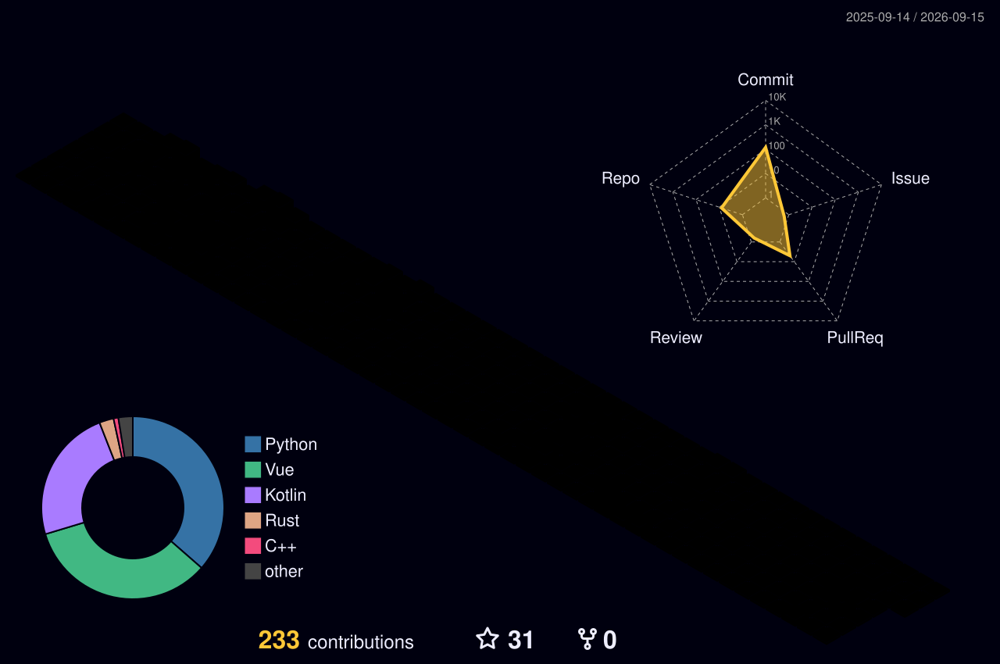

<h1 style="text-align: center">Привет мир!</h1>


<p align="center">
  
</p>

## Познакомимся?)
Меня зовут Игорь, я программист из России.
Занимаюсь программированием чуть больше 3-х лет, посвящаю этому делу все свободное время.
Люблю шахматы и котиков :3

Вы можете сделать заказ в моем [телеграмм канале](https://t.me/kingchev_works)

## Навыки и знания
<picture>
  <source media="(prefers-color-scheme: dark)" srcset="https://raw.githubusercontent.com/kiNgchev/kiNgchev/output/github-contribution-grid-snake-dark.svg">
  <source media="(prefers-color-scheme: light)" srcset="https://raw.githubusercontent.com/kiNgchev/kiNgchev/output/github-contribution-grid-snake.svg">
  
</picture>

### Языки: 


 \


### Фреймворки: 


### Сервисы: 


 \


### IDE:


## Мои контакты:
- Discord: [_kingchev](https://discord.com/users/743878110747033691)
- Telegram: [kiNgchev Hub](https://t.me/k1ngchev), [kiNgchev works](https://t.me/kingchev_works)
- Twitch: [k1ngchev](https://www.twitch.tv/k1ngchev)
- Youtube: [KiNgchev Hub](https://www.youtube.com/channel/UC1-4OolMyPyZPJguuztT87Q)
- X: [kiNgchev](https://x.com/TheKiNgchev)
- Bio: [Website](https://kingchev.net/)

## Статистика

<!--START_SECTION:waka-->


**🐱 My GitHub Data** 

> 📦 300.1 kB Used in GitHub's Storage 
 > 
> 🏆 110 Contributions in the Year 2026
 > 
> 🚫 Not Opted to Hire
 > 
> 📜 30 Public Repositories 
 > 
> 🔑 19 Private Repositories 
 > 
**I'm a Night 🦉** 

```text
🌞 Morning                51 commits          ██░░░░░░░░░░░░░░░░░░░░░░░   06.53 % 
🌆 Daytime                200 commits         ██████░░░░░░░░░░░░░░░░░░░   25.61 % 
🌃 Evening                433 commits         ██████████████░░░░░░░░░░░   55.44 % 
🌙 Night                  97 commits          ███░░░░░░░░░░░░░░░░░░░░░░   12.42 % 
```
📅 **I'm Most Productive on Sunday** 

```text
Monday                   90 commits          ███░░░░░░░░░░░░░░░░░░░░░░   11.52 % 
Tuesday                  121 commits         ████░░░░░░░░░░░░░░░░░░░░░   15.49 % 
Wednesday                104 commits         ███░░░░░░░░░░░░░░░░░░░░░░   13.32 % 
Thursday                 93 commits          ███░░░░░░░░░░░░░░░░░░░░░░   11.91 % 
Friday                   107 commits         ███░░░░░░░░░░░░░░░░░░░░░░   13.70 % 
Saturday                 118 commits         ████░░░░░░░░░░░░░░░░░░░░░   15.11 % 
Sunday                   148 commits         █████░░░░░░░░░░░░░░░░░░░░   18.95 % 
```


📊 **This Week I Spent My Time On** 

```text
🕑︎ Time Zone: Europe/Moscow

💬 Programming Languages: 
Vue                      17 hrs 17 mins      █████████████████████░░░░   82.62 % 
TypeScript               1 hr 27 mins        ██░░░░░░░░░░░░░░░░░░░░░░░   06.99 % 
SCSS                     1 hr 1 min          █░░░░░░░░░░░░░░░░░░░░░░░░   04.90 % 
Python                   32 mins             █░░░░░░░░░░░░░░░░░░░░░░░░   02.59 % 
Image (svg)              13 mins             ░░░░░░░░░░░░░░░░░░░░░░░░░   01.06 % 

🔥 Editors: 
IntelliJ IDEA            20 hrs 55 mins      █████████████████████████   100.00 % 

🐱‍💻 Projects: 
bio-remaster             20 hrs 15 mins      ████████████████████████░   96.82 % 
linari-bot               39 mins             █░░░░░░░░░░░░░░░░░░░░░░░░   03.18 % 

💻 Operating System: 
Windows                  20 hrs 55 mins      █████████████████████████   100.00 % 
```

🤖 **AI Coding This Week** 

```text
No AI Coding Activity Tracked This Week
```

**I Mostly Code in Kotlin** 

```text
Kotlin                   23 repos            ██████████░░░░░░░░░░░░░░░   41.07 % 
Python                   10 repos            ████░░░░░░░░░░░░░░░░░░░░░   17.86 % 
Vue                      2 repos             █░░░░░░░░░░░░░░░░░░░░░░░░   03.57 % 
Rust                     1 repo              ░░░░░░░░░░░░░░░░░░░░░░░░░   01.79 % 
C++                      1 repo              ░░░░░░░░░░░░░░░░░░░░░░░░░   01.79 % 
```


**Timeline**


 Last Updated on 30/08/2026 19:40:55 UTC
<!--END_SECTION:waka-->

## Donate
<a align="center" href=https://www.donationalerts.com/r/kingchev>
    
</a> 
