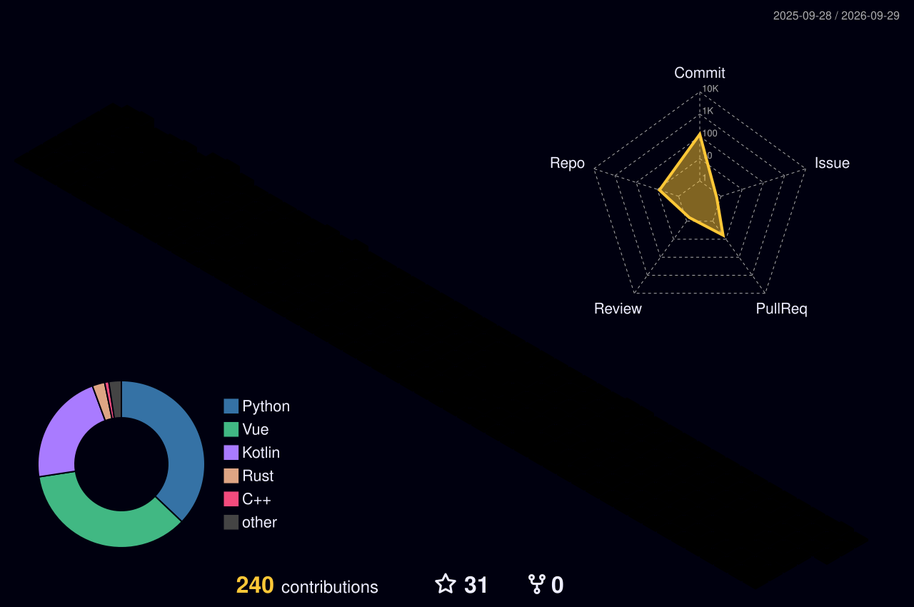

<h1 style="text-align: center">Привет мир!</h1>


<p align="center">
  
</p>

## Познакомимся?)
Меня зовут Игорь, я программист из России.
Занимаюсь программированием чуть больше 3-х лет, посвящаю этому делу все свободное время.
Люблю шахматы и котиков :3

Вы можете сделать заказ в моем [телеграмм канале](https://t.me/kingchev_works)

## Навыки и знания
<picture>
  <source media="(prefers-color-scheme: dark)" srcset="https://raw.githubusercontent.com/kiNgchev/kiNgchev/output/github-contribution-grid-snake-dark.svg">
  <source media="(prefers-color-scheme: light)" srcset="https://raw.githubusercontent.com/kiNgchev/kiNgchev/output/github-contribution-grid-snake.svg">
  
</picture>

### Языки: 


 \


### Фреймворки: 


### Сервисы: 


 \


### IDE:


## Мои контакты:
- Discord: [_kingchev](https://discord.com/users/743878110747033691)
- Telegram: [kiNgchev Hub](https://t.me/k1ngchev), [kiNgchev works](https://t.me/kingchev_works)
- Twitch: [k1ngchev](https://www.twitch.tv/k1ngchev)
- Youtube: [KiNgchev Hub](https://www.youtube.com/channel/UC1-4OolMyPyZPJguuztT87Q)
- X: [kiNgchev](https://x.com/TheKiNgchev)
- Bio: [Website](https://kingchev.net/)

## Статистика

<!--START_SECTION:waka-->


**🐱 My GitHub Data** 

> 📦 301.4 kB Used in GitHub's Storage 
 > 
> 🏆 126 Contributions in the Year 2026
 > 
> 🚫 Not Opted to Hire
 > 
> 📜 30 Public Repositories 
 > 
> 🔑 19 Private Repositories 
 > 
**I'm a Night 🦉** 

```text
🌞 Morning                52 commits          ██░░░░░░░░░░░░░░░░░░░░░░░   06.09 % 
🌆 Daytime                229 commits         ███████░░░░░░░░░░░░░░░░░░   26.81 % 
🌃 Evening                445 commits         █████████████░░░░░░░░░░░░   52.11 % 
🌙 Night                  128 commits         ████░░░░░░░░░░░░░░░░░░░░░   14.99 % 
```
📅 **I'm Most Productive on Sunday** 

```text
Monday                   97 commits          ███░░░░░░░░░░░░░░░░░░░░░░   11.36 % 
Tuesday                  128 commits         ████░░░░░░░░░░░░░░░░░░░░░   14.99 % 
Wednesday                121 commits         ████░░░░░░░░░░░░░░░░░░░░░   14.17 % 
Thursday                 109 commits         ███░░░░░░░░░░░░░░░░░░░░░░   12.76 % 
Friday                   109 commits         ███░░░░░░░░░░░░░░░░░░░░░░   12.76 % 
Saturday                 132 commits         ████░░░░░░░░░░░░░░░░░░░░░   15.46 % 
Sunday                   158 commits         █████░░░░░░░░░░░░░░░░░░░░   18.50 % 
```


📊 **This Week I Spent My Time On** 

```text
🕑︎ Time Zone: Europe/Moscow

💬 Programming Languages: 
Python                   11 hrs 56 mins      ███████████████████░░░░░░   76.05 % 
Vue                      1 hr 6 mins         ██░░░░░░░░░░░░░░░░░░░░░░░   07.06 % 
Markdown                 1 hr 1 min          ██░░░░░░░░░░░░░░░░░░░░░░░   06.53 % 
Rust                     31 mins             █░░░░░░░░░░░░░░░░░░░░░░░░   03.30 % 
TypeScript               29 mins             █░░░░░░░░░░░░░░░░░░░░░░░░   03.14 % 

🔥 Editors: 
IntelliJ IDEA            13 hrs 10 mins      █████████████████████░░░░   83.94 % 
Codex Vscode             2 hrs 25 mins       ████░░░░░░░░░░░░░░░░░░░░░   15.50 % 
Codex CLI                5 mins              ░░░░░░░░░░░░░░░░░░░░░░░░░   00.56 % 
RustRover                0 secs              ░░░░░░░░░░░░░░░░░░░░░░░░░   00.00 % 

🐱‍💻 Projects: 
sj-backend               13 hrs 10 mins      █████████████████████░░░░   83.93 % 
bio-remaster             1 hr 43 mins        ███░░░░░░░░░░░░░░░░░░░░░░   10.98 % 
korvax-va                30 mins             █░░░░░░░░░░░░░░░░░░░░░░░░   03.29 % 
linari-bot               15 mins             ░░░░░░░░░░░░░░░░░░░░░░░░░   01.65 % 
Unknown Project          1 min               ░░░░░░░░░░░░░░░░░░░░░░░░░   00.14 % 

💻 Operating System: 
Windows                  15 hrs 42 mins      █████████████████████████   100.00 % 
```

🤖 **AI Coding This Week** 

```text
⏱ AI Coding Time: 3 hrs 37 mins (23.11%)

✍️ 1,743 lines written by AI, 824 lines written by hand (67.9% AI-written)

🔤 1,257,970 Input Tokens, 126,438 Output Tokens

💵 $51.28 Estimated AI Cost This Week

🧠 16 AI Sessions, 69 AI Prompts

GPT                      1,902 lines         █████████████████████████   100.00 % 
Codex-Vscode             0 lines             ░░░░░░░░░░░░░░░░░░░░░░░░░   00.00 % 

🔎 AI Coding Insights:
🤖 AI-Driven — 67.9% of written lines came from AI
📚 Verbose Prompter — average 4,674 characters per prompt
🔁 Iterative Prompter — average 4 prompts per session
🚀 High AI Trust — 48.77% of changed lines were hand-edited
```

**I Mostly Code in Kotlin** 

```text
Kotlin                   23 repos            ██████████░░░░░░░░░░░░░░░   41.07 % 
Python                   10 repos            ████░░░░░░░░░░░░░░░░░░░░░   17.86 % 
Vue                      2 repos             █░░░░░░░░░░░░░░░░░░░░░░░░   03.57 % 
Rust                     1 repo              ░░░░░░░░░░░░░░░░░░░░░░░░░   01.79 % 
C++                      1 repo              ░░░░░░░░░░░░░░░░░░░░░░░░░   01.79 % 
```


**Timeline**


 Last Updated on 29/09/2026 21:19:16 UTC
<!--END_SECTION:waka-->

## Donate
<a align="center" href=https://www.donationalerts.com/r/kingchev>
    
</a> 
